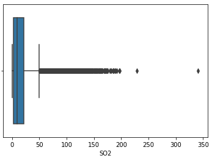
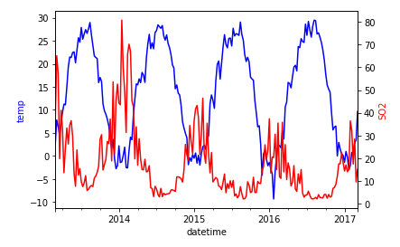
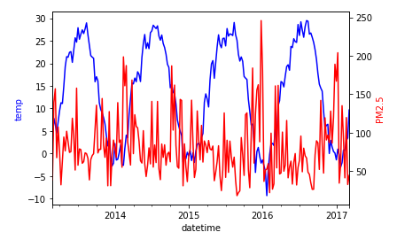
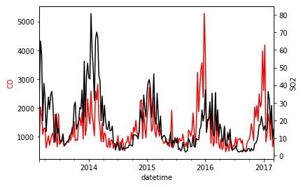
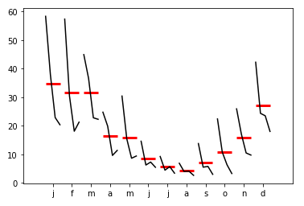
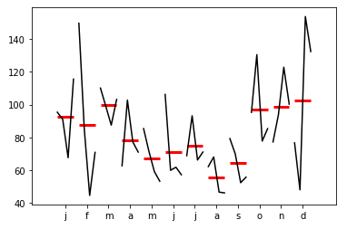
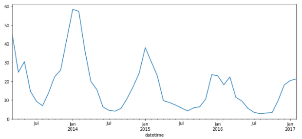

# Air Quality Prediction: Project Overview
* Created a tool that performs air quality prediction
* Engineered time series missing data using "seasonal adjustment + linear interpolation" imputation method
* Performed time series prediction using the SARIMAX model

## Code and Resourcs Used
**Python version:** 3.8

**Packages:** statsmodel, pmdarima, sklearn, pandas, numpy, matplotlib, seaborn

## Data Preprocessing
Extracted the date and time columns, set "datetime" as index, and only kept features that are most relevant:
* PM2.5
* SO2
* NO2
* CO
* O3
* TEMP
* RAIN

## Feature Engineering
### Missing values
Every feature includes missing values, however, almost all are under 5%:

#### **Imputation strategy**
With a slight presence of trend and a clear presence of seasonality, I decided to use a seasonal adjusted linear interpolation method

## EDA
### Distribution
Certain variables are extremely skewed:

### Correlation
However, after checking correlations among varaibles, I found that when a group of variables can get extreme when weather gets extreme, which is not entirely ususual in Beijing

(when SO2 or O3 are excessive)

### Among features
SO2 and temperature have a strong negative correlation

PM2.5 does not have a strong correlation with temperature and no clear seasonality either

SO2 and CO have a very strong correlation

Since most air pollutants all have very strong correlation, I decided to predict only the SO2 and PM2.5 values

Seasonality of the 2 target variables

 

## Model Building
First, I performed the augmented Dickey-Fuller test on the 2 variables to test the stationarity of the dataset. Since both variables are stationary, no further transformations are needed

Then, I resampled the dataset to monthly frequency for the purpose of prediction

I tried 2 different models and evaluated them using Root Mean Square Error
* ARIMA
* SARIMAX
